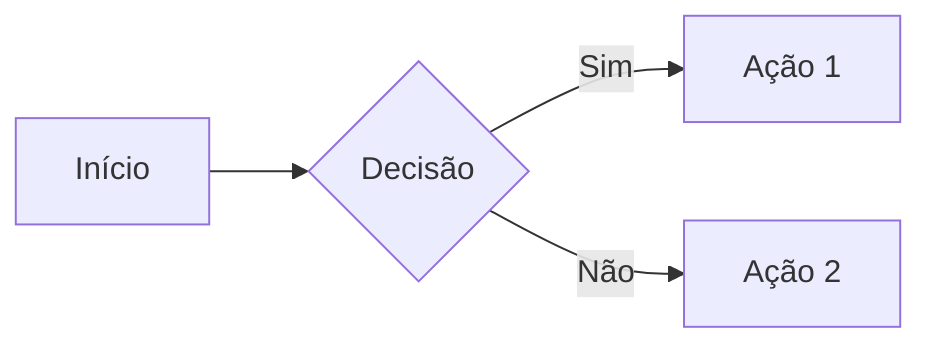

# Guia de Markdown

## Introdução

Markdown é uma linguagem de marcação leve criada por John Gruber em 2004. Seu objetivo é permitir que você escreva texto formatado usando uma sintaxe simples e legível, que depois pode ser convertida para HTML ou outros formatos.

Este guia cobre a sintaxe padrão do Markdown e algumas extensões comuns.

---

## Títulos

Use `#` para criar títulos. Quanto mais `#`, menor o nível do título.

```markdown
# Título 1 (H1)
## Título 2 (H2)
### Título 3 (H3)
#### Título 4 (H4)
##### Título 5 (H5)
###### Título 6 (H6)
```

**Resultado:**

# Título 1 (H1)
## Título 2 (H2)
### Título 3 (H3)
#### Título 4 (H4)
##### Título 5 (H5)
###### Título 6 (H6)

---

## Parágrafos e Quebras de Linha

Parágrafos são separados por uma linha em branco.

```markdown
Este é o primeiro parágrafo.

Este é o segundo parágrafo.
```

Para quebrar linha sem criar novo parágrafo, termine a linha com dois espaços ou use `<br>`.

```markdown
Primeira linha
Segunda linha (mesma parágrafo)
```

---

## Ênfase

### Itálico

```markdown
*texto em itálico*
_também itálico_
```

**Resultado:** *texto em itálico*

### Negrito

```markdown
**texto em negrito**
__também negrito__
```

**Resultado:** **texto em negrito**

### Negrito e Itálico

```markdown
***negrito e itálico***
___também funciona___
```

**Resultado:** ***negrito e itálico***

### Tachado

```markdown
~~texto tachado~~
```

**Resultado:** ~~texto tachado~~

---

## Listas

### Lista Não Ordenada

Use `-`, `*` ou `+` para criar itens.

```markdown
- Item 1
- Item 2
  - Subitem 2.1
  - Subitem 2.2
- Item 3
```

**Resultado:**

- Item 1
- Item 2
  - Subitem 2.1
  - Subitem 2.2
- Item 3

### Lista Ordenada

Use números seguidos de ponto.

```markdown
1. Primeiro item
2. Segundo item
3. Terceiro item
   1. Subitem 3.1
   2. Subitem 3.2
```

**Resultado:**

1. Primeiro item
2. Segundo item
3. Terceiro item
   1. Subitem 3.1
   2. Subitem 3.2

### Lista de Tarefas

```markdown
- [x] Tarefa concluída
- [ ] Tarefa pendente
- [ ] Outra tarefa pendente
```

**Resultado:**

- [x] Tarefa concluída
- [ ] Tarefa pendente
- [ ] Outra tarefa pendente

---

## Links

### Link Inline

```markdown
[Texto do link](https://exemplo.com)
[Link com título](https://exemplo.com "Título ao passar o mouse")
```

**Resultado:** [Texto do link](https://exemplo.com)

### Link de Referência

```markdown
[Texto do link][ref1]

[ref1]: https://exemplo.com
```

### Link Automático

```markdown
<https://exemplo.com>
<email@exemplo.com>
```

---

## Imagens

### Imagem Inline

```markdown


```

### Imagem de Referência

```markdown
![Texto alternativo][img1]

[img1]: url-da-imagem.jpg
```

### Imagem com Link

```markdown
[](https://link-destino.com)
```

---

## Citações

Use `>` para criar blocos de citação.

```markdown
> Esta é uma citação.
> Pode ter múltiplas linhas.
>
> E múltiplos parágrafos.
```

**Resultado:**

> Esta é uma citação.
> Pode ter múltiplas linhas.
>
> E múltiplos parágrafos.

### Citações Aninhadas

```markdown
> Citação principal
>> Citação aninhada
>>> Mais aninhada ainda
```

---

## Código

### Código Inline

Use crases simples para código no meio do texto.

```markdown
Use o comando `git status` para ver o estado.
```

**Resultado:** Use o comando `git status` para ver o estado.

### Bloco de Código

Use três crases para blocos de código.

````markdown
```
código sem syntax highlighting
```
````

### Bloco com Syntax Highlighting

Especifique a linguagem após as crases.

````markdown
```python
def hello():
    print("Hello, World!")
```
````

**Resultado:**

```python
def hello():
    print("Hello, World!")
```

**Linguagens comuns:** `python`, `javascript`, `typescript`, `bash`, `json`, `yaml`, `sql`, `html`, `css`, `markdown`

---

## Tabelas

```markdown
| Coluna 1 | Coluna 2 | Coluna 3 |
|----------|----------|----------|
| Valor 1  | Valor 2  | Valor 3  |
| Valor 4  | Valor 5  | Valor 6  |
```

**Resultado:**

| Coluna 1 | Coluna 2 | Coluna 3 |
|----------|----------|----------|
| Valor 1  | Valor 2  | Valor 3  |
| Valor 4  | Valor 5  | Valor 6  |

### Alinhamento

```markdown
| Esquerda | Centro | Direita |
|:---------|:------:|--------:|
| texto    | texto  | texto   |
| alinhado | ao     | à       |
| esquerda | centro | direita |
```

**Resultado:**

| Esquerda | Centro | Direita |
|:---------|:------:|--------:|
| texto    | texto  | texto   |
| alinhado | ao     | à       |
| esquerda | centro | direita |

---

## Linhas Horizontais

Use três ou mais `-`, `*` ou `_`.

```markdown
---
***
___
```

**Resultado:**

---

## Escape de Caracteres

Use `\` para escapar caracteres especiais.

```markdown
\*não é itálico\*
\# não é título
\[não é link\]
```

**Resultado:** \*não é itálico\*

**Caracteres que podem ser escapados:**

```
\ ` * _ { } [ ] ( ) # + - . ! |
```

---

## HTML Inline

Markdown permite HTML quando necessário.

```markdown
<div style="color: red;">
  Texto em vermelho
</div>

Texto normal com <sup>sobrescrito</sup> e <sub>subscrito</sub>.
```

---

## Notas de Rodapé

```markdown
Aqui está uma frase com nota de rodapé[^1].

[^1]: Esta é a nota de rodapé.
```

---

## Definições (Extensão)

```markdown
Termo
: Definição do termo

Markdown
: Linguagem de marcação leve para formatação de texto.
```

---

## Blocos Colapsáveis (GitHub)

```markdown
<details>
<summary>Clique para expandir</summary>

Conteúdo oculto aqui.

- Item 1
- Item 2

</details>
```

**Resultado:**

<details>
<summary>Clique para expandir</summary>

Conteúdo oculto aqui.

- Item 1
- Item 2

</details>

---

## Emojis (GitHub)

```markdown
:smile: :rocket: :thumbsup: :heart:
```

Veja lista completa em: https://gist.github.com/rxaviers/7360908

---

## Diagramas Mermaid (GitHub)

````markdown

````

---

## Boas Práticas

1. **Seja consistente** - Escolha um estilo e mantenha (ex: sempre `*` para itálico)
2. **Use linhas em branco** - Separe elementos diferentes com linhas vazias
3. **Indentação** - Use 2 ou 4 espaços para subitens de listas
4. **Nomes descritivos** - Links e imagens devem ter texto alternativo útil
5. **Evite HTML** - Use apenas quando Markdown não for suficiente
6. **Quebre linhas longas** - Facilita a leitura do código-fonte

---

## Referências

- [Documentação oficial do Markdown](https://daringfireball.net/projects/markdown/)
- [GitHub Flavored Markdown](https://github.github.com/gfm/)
- [CommonMark Spec](https://commonmark.org/)
- [Markdown Guide](https://www.markdownguide.org/)
